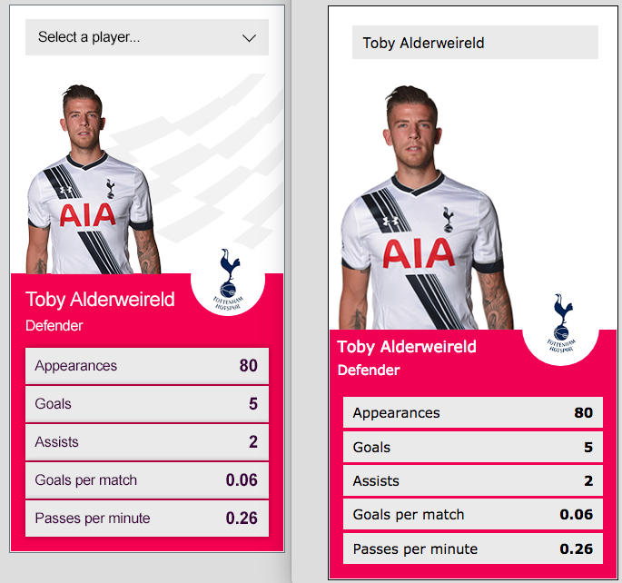

## Player Card React app

### Project information

This app creates a React component which renders to the screen a list of players with associated data e.g. player information, player statistics, club badge, player image. Club badges are being fetched from image sprite via CSS classes with x/y coordinates. Player images are static assets with names matching the unique IDs on player data JSON. Data JSON file provides complete information to feed the component.

This app was rewritten from scratch from the [***earlier version***](https://github.com/maciejk77/player-card/tree/version-B) to use minimal set up of **create-react-app**, Sass, cleaner/more compact code, ES6 destructuring, Flex.

### Instruction
- ```git clone``` the project repo
- ```yarn install``` to install all dependencies
- ```yarn start``` to kickstart FE application

### Steps completed
- used functional and class React components
- used ***create-react-app** to scaffold application
- used ***node-sass-chokidar*** to transpile Sass to CSS on build, ***watch-css*** to transpile while developing
- images fetched from assets folder using template strings ```e.g. id:4916 => p${id}.png```
- club badges are created from image sprite and accessible via CSS classess e.g. ```.arsenal {}```
- used ***.filter***, ***.map***, to get matching player data, ***.reduce*** to remap stats object ```{name: 'goals', value: 5} ==> {'goals': 5, ...}```
- version on ```master-redux``` branch has got state management implemented with ***Redux*** (not deployed to Heroku)
- version on ```master-hooks``` branch have ```master``` component Dropdown.js refacored to ***React hooks***

### To do / ideas
- create seperate branch where data will be put on Express server
- fix custom 'chevron down' and menu on select
- try to add the gray custom shapes as per requested output below (behind player image)
- add some tests

### Screenshot

The below [***live version is available here***](https://player-card-react.herokuapp.com/) deployed to Heroku 

Left image is the requested final piece, to the right is the component recreated as requested
